# Ollocode

**🇮🇹 Italiano** · [🇬🇧 English](README.en.md)

[](https://github.com/sponsors/kikoz85)

**[⬇️ Scarica l'ultima versione per macOS](https://github.com/kikoz85/Ollocode/releases/latest)**

IDE per macOS con un **agente che scrive, esegue e verifica il codice usando solo modelli locali** (Ollama o Apple MLX). Nessun dato lascia il Mac: niente cloud, niente chiavi API.

Descrivi cosa vuoi costruire o correggere: l'agente legge il progetto, scrive il codice, esegue test e programmi, legge gli errori e corregge finché il lavoro non è verificato. Funziona su progetti locali e su server remoti via SSH (per esempio uno stack LAMP).

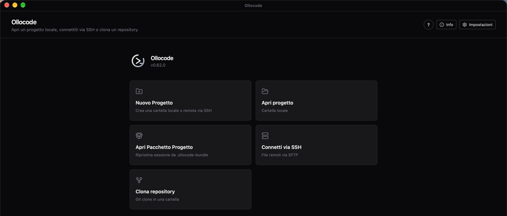

## Funzioni principali

### Un agente che verifica il proprio lavoro

L'agente non si limita a proporre codice: lo scrive nei file, lo esegue e controlla il risultato. Non accetta di aver finito se i test falliscono, se l'ultima modifica non è mai stata eseguita o se restano attività aperte nella sua lista.

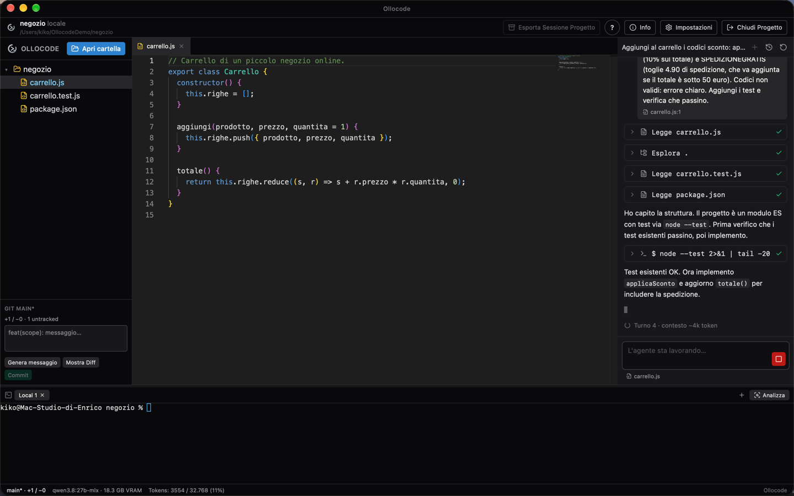

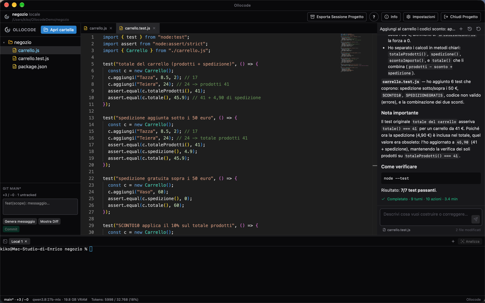

### Editor, differenze, Git e terminale

Editor Monaco con completamento inline da un modello locale, differenze rispetto all'ultimo commit, pannello Git con messaggio di commit generato, terminale integrato.

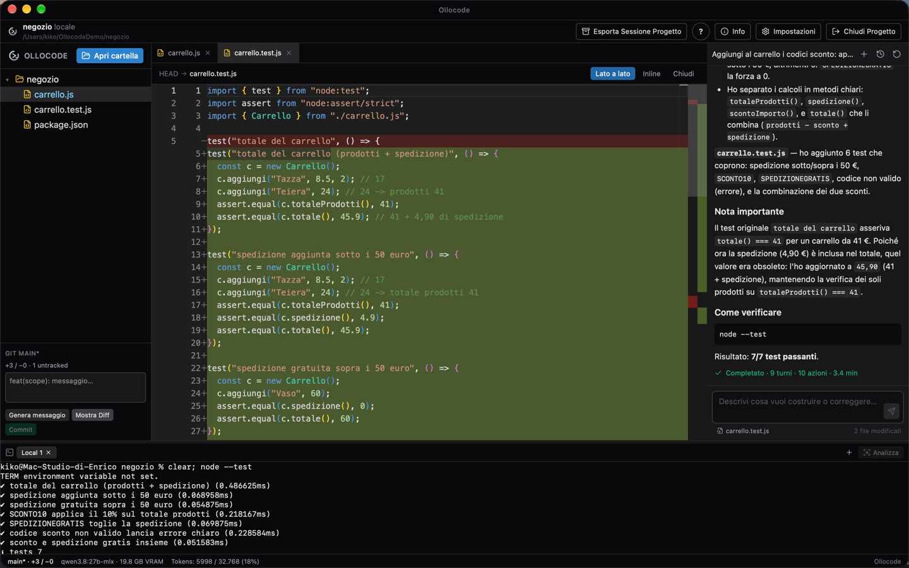

### Progetti remoti via SSH (PHP, MySQL, WordPress)

Apri una cartella su un server Linux con la tua chiave SSH: file, terminale e agente lavorano direttamente sul server. Qui l'agente ha creato un'API PHP e l'ha verificata avviando il server di sviluppo e chiamandola con `curl`.

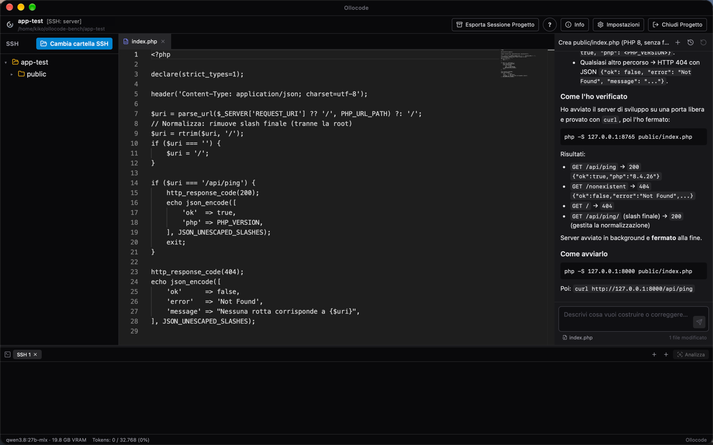

### Si adatta al tuo Mac

Ollocode legge chip e memoria e sceglie modello, finestra di contesto e lunghezza delle risposte misurati per quella fascia di Mac. Il modello consigliato, se manca, viene proposto per il download.

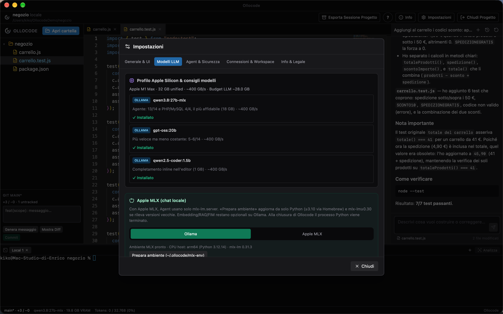

### Sicurezza

I comandi dell'agente girano in una sandbox di macOS (scrittura solo nel progetto, nelle cartelle temporanee e nelle cache degli strumenti). Sui progetti SSH vengono bloccati i comandi che scriverebbero fuori dalla cartella del progetto. Prima di ogni turno che modifica file viene creato un punto di ripristino.

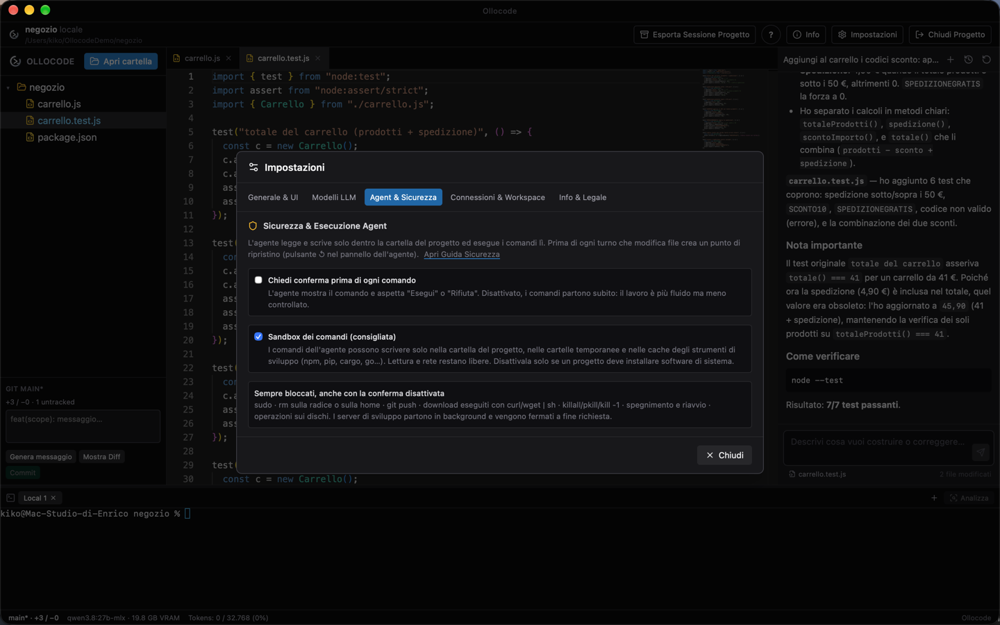

### Modalità Piano

Prima di toccare i file puoi concordare il lavoro: in **Piano** l'agente legge il progetto e propone i passi, senza modificare nulla. Chiedi le modifiche che vuoi (togli un passo, cambia una scelta tecnica) finché il piano ti convince. Il piano viene salvato nel progetto come **PIANO.md**, con i passi in una checklist. Poi lo esegui **un passo alla volta** (▶ sul passo o *Esegui il prossimo passo*) oppure tutto insieme: ogni passo viene verificato e la sua casella in PIANO.md si spunta da sola.

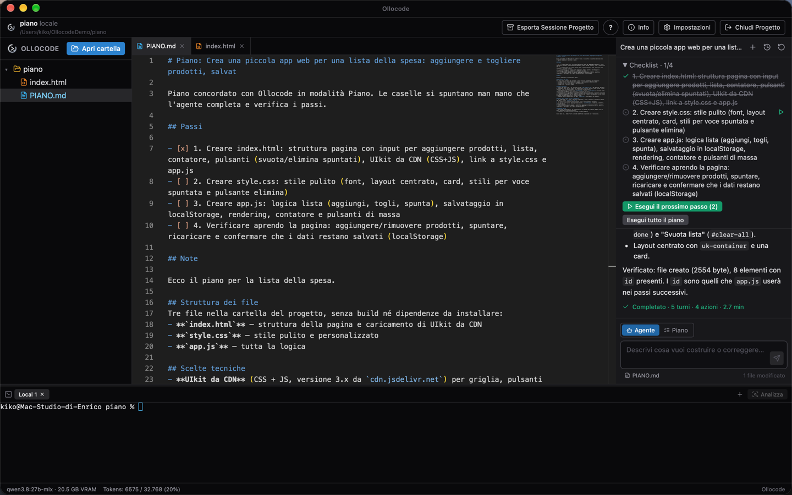

### Internet, con il tuo consenso

Quando serve un'informazione aggiornata (l'ultima versione di una libreria o del suo link CDN, la documentazione ufficiale, un errore che non riesce a risolvere) l'agente può cercare sul web e leggere le pagine. Ogni accesso chiede **Consenti**, **Consenti sempre in questa conversazione** o **Rifiuta**.

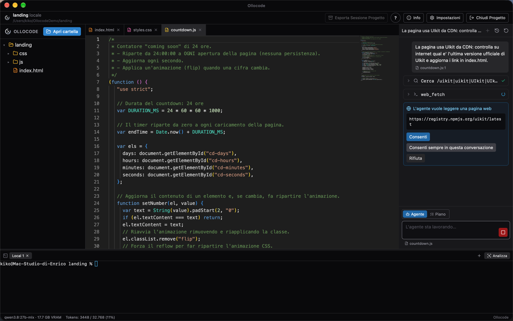

### Installazioni e configurazioni di sistema, con il tuo consenso

L'agente può installare software, configurare cron e servizi, creare un virtual host Apache, anche con `sudo`, sul Mac o sul server. Ogni comando di sistema compare con il testo esatto e parte solo se premi **Esegui**. Se serve sudo, la password la scrivi tu nella scheda: non arriva mai al modello e non viene salvata.

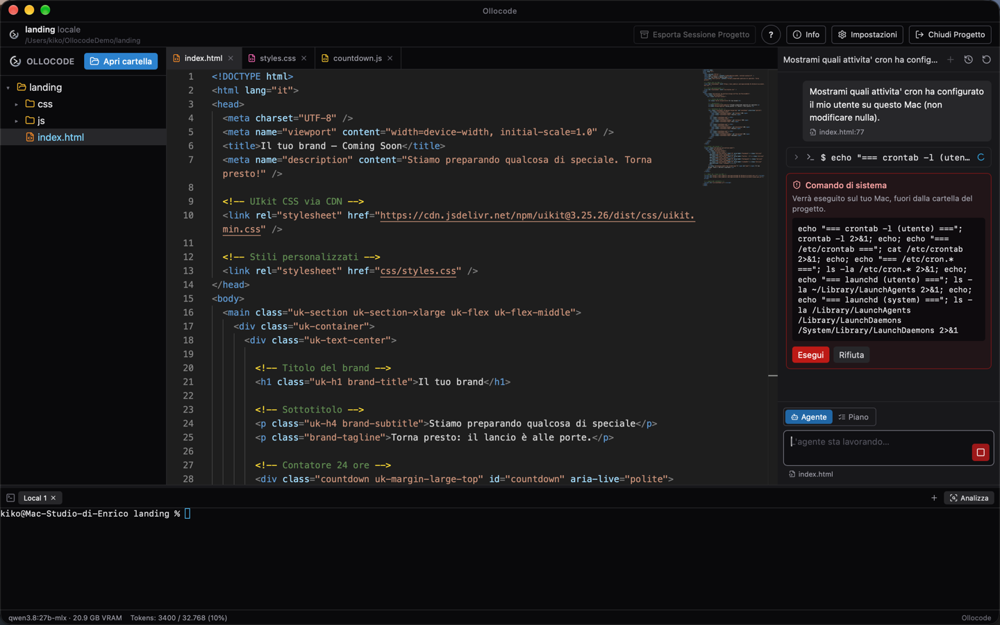

### Altro

- **Routine di debug**: quando lo stesso errore si ripresenta dopo tre correzioni, l'agente deve prima fare una diagnosi (eseguire solo il test che fallisce, stampare i valori) e solo dopo può modificare di nuovo i file.
- **Note di progetto** (`.ollocode/notes.md`): architettura, comandi e decisioni restano disponibili all'agente tra una richiesta e l'altra.
- **Sotto-agenti**: l'agente può affidare un modulo a un altro agente con un contesto pulito.
- **Aggiornamenti dall'app**: quando su GitHub esce una nuova versione compare un avviso con le novità; **Aggiorna ora** la scarica, ne verifica la firma, la installa e riavvia Ollocode.
- Lingue dell'interfaccia: italiano, inglese, tedesco, francese, spagnolo.

## Quale Mac e quale modello

Ogni modello è stato misurato con lo stesso benchmark: 14 progetti reali (Go, Python, Node.js, TypeScript, Rust, web full-stack) da scrivere da zero o da correggere, superati solo se passano i test automatici. Ogni dato viene da un singolo giro, con una variabilità di ±1-2 compiti.

| Mac | Modello dell'agente (predefinito) | Benchmark | Note |
|---|---|---|---|
| 16 GB (es. Mac mini M4) | `qwen3.5:9b` | 7/14 | compiti piccoli e medi; 7,3 GB con 32k di contesto |
| 24 GB | `gpt-oss:20b` | 5-6/14 | molto veloce (pochi minuti per compito), meno costante |
| 32 GB e oltre | `qwen3.8:27b-mlx` | 13/14 + PHP/MySQL 4/4 | il più affidabile; più lento (~10 token/s su M1 Max) |

Il completamento inline nell'editor usa `qwen2.5-coder:1.5b` (1 GB). Modelli provati come agente e scartati: `qwen2.5-coder:7b` e `:14b` (0/14: non usano i tool in modo affidabile), `qwen3:8b` e `qwen3:14b` (0/5).

## Installazione

1. Installa [Ollama](https://ollama.com) e avvialo.
2. Scarica il DMG dall'ultima [release](https://github.com/kikoz85/Ollocode/releases/latest), apri il file e trascina **Ollocode** in **Applicazioni**.
3. Al primo avvio macOS blocca l'app perché non è firmata con un certificato Apple Developer: apri **Impostazioni di Sistema → Privacy e sicurezza** e fai clic su **Apri comunque**. In alternativa, dal Terminale:
   ```bash
   xattr -dr com.apple.quarantine /Applications/Ollocode.app
   ```
4. Apri un progetto: Ollocode propone di scaricare il modello adatto al tuo Mac.

Requisiti: Mac con Apple Silicon (M1 o successivo) e almeno 16 GB di memoria.

## Sostieni Ollocode

Ollocode è gratuito e lavora solo in locale. Se ti è utile, puoi sostenerne lo sviluppo con **[GitHub Sponsors](https://github.com/sponsors/kikoz85)** ❤️. Il pulsante "Sostieni Ollocode" è anche nell'app, in **Impostazioni**.

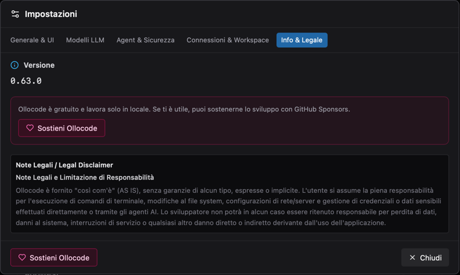

## Autore

Enrico Fanucchi
